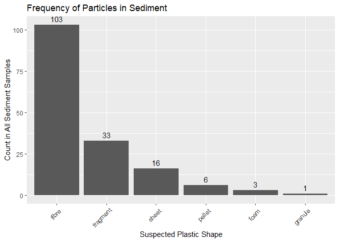
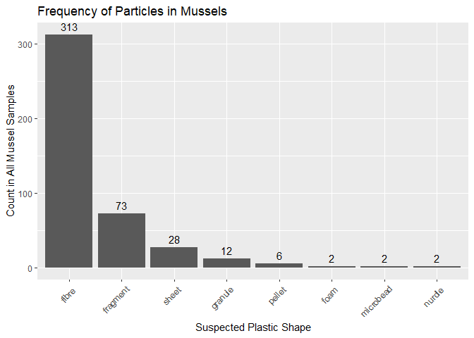
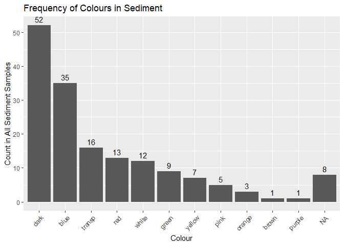
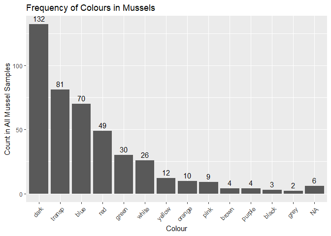
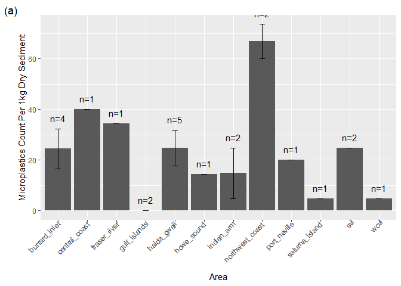
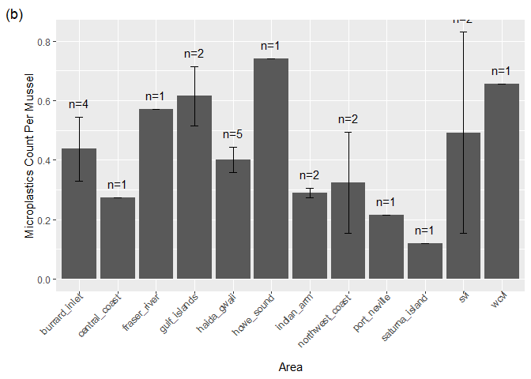
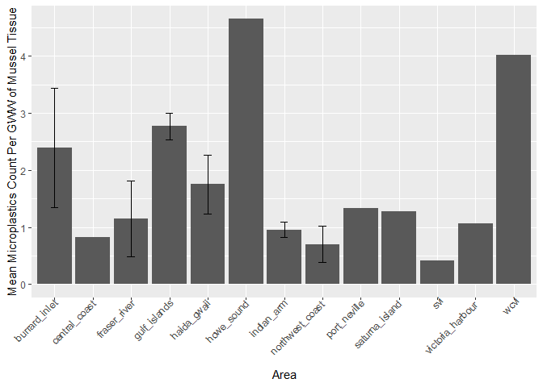

This is an overview of Phase 1 Microplastics Data for Pollution Tracker

### Data  

<table class="table table-bordered" style="margin-left: auto; margin-right: auto;">
 <thead>
  <tr>
   <th style="text-align:left;">   </th>
   <th style="text-align:left;"> site </th>
   <th style="text-align:left;"> area </th>
   <th style="text-align:left;"> shape </th>
   <th style="text-align:left;"> color </th>
   <th style="text-align:right;"> long_axis </th>
   <th style="text-align:right;"> short_axis </th>
   <th style="text-align:left;"> susp_plastic </th>
   <th style="text-align:left;"> ftir </th>
   <th style="text-align:left;"> final_name_particle </th>
   <th style="text-align:left;"> origin_particle </th>
   <th style="text-align:left;"> category_particle </th>
   <th style="text-align:left;"> group_particle </th>
   <th style="text-align:left;"> ftir_particle_id </th>
  </tr>
 </thead>
<tbody>
  <tr>
   <td style="text-align:left;"> 148 </td>
   <td style="text-align:left;"> nwc2 </td>
   <td style="text-align:left;"> northwest_coast </td>
   <td style="text-align:left;"> fibre </td>
   <td style="text-align:left;"> orange </td>
   <td style="text-align:right;"> 947.1 </td>
   <td style="text-align:right;"> 19.31 </td>
   <td style="text-align:left;"> yes </td>
   <td style="text-align:left;"> yes </td>
   <td style="text-align:left;"> cellulosic </td>
   <td style="text-align:left;"> unknown </td>
   <td style="text-align:left;"> cellulosic </td>
   <td style="text-align:left;"> cellulose </td>
   <td style="text-align:left;"> ptp1_nwc2_2 </td>
  </tr>
  <tr>
   <td style="text-align:left;"> 149 </td>
   <td style="text-align:left;"> nwc2 </td>
   <td style="text-align:left;"> northwest_coast </td>
   <td style="text-align:left;"> fibre </td>
   <td style="text-align:left;"> blue </td>
   <td style="text-align:right;"> 864.5 </td>
   <td style="text-align:right;"> 10.28 </td>
   <td style="text-align:left;"> yes </td>
   <td style="text-align:left;"> yes </td>
   <td style="text-align:left;"> polyester </td>
   <td style="text-align:left;"> synthetic </td>
   <td style="text-align:left;"> plastic </td>
   <td style="text-align:left;"> polyester </td>
   <td style="text-align:left;"> ptp1_nwc2_3 </td>
  </tr>
  <tr>
   <td style="text-align:left;"> 150 </td>
   <td style="text-align:left;"> pb </td>
   <td style="text-align:left;"> svi </td>
   <td style="text-align:left;"> fibre </td>
   <td style="text-align:left;"> dark </td>
   <td style="text-align:right;"> 6428.0 </td>
   <td style="text-align:right;"> 21.16 </td>
   <td style="text-align:left;"> yes </td>
   <td style="text-align:left;"> yes </td>
   <td style="text-align:left;"> polyester </td>
   <td style="text-align:left;"> synthetic </td>
   <td style="text-align:left;"> plastic </td>
   <td style="text-align:left;"> polyester </td>
   <td style="text-align:left;"> ptp1_pb_1 </td>
  </tr>
  <tr>
   <td style="text-align:left;"> 151 </td>
   <td style="text-align:left;"> pb </td>
   <td style="text-align:left;"> svi </td>
   <td style="text-align:left;"> fibre </td>
   <td style="text-align:left;"> NA </td>
   <td style="text-align:right;"> 621.5 </td>
   <td style="text-align:right;"> 8.87 </td>
   <td style="text-align:left;"> no </td>
   <td style="text-align:left;"> no </td>
   <td style="text-align:left;"> NA </td>
   <td style="text-align:left;"> NA </td>
   <td style="text-align:left;"> NA </td>
   <td style="text-align:left;"> NA </td>
   <td style="text-align:left;"> ptp1_pb_2 </td>
  </tr>
  <tr>
   <td style="text-align:left;"> 152 </td>
   <td style="text-align:left;"> pb </td>
   <td style="text-align:left;"> svi </td>
   <td style="text-align:left;"> fragment </td>
   <td style="text-align:left;"> red </td>
   <td style="text-align:right;"> 136.8 </td>
   <td style="text-align:right;"> 46.30 </td>
   <td style="text-align:left;"> no </td>
   <td style="text-align:left;"> yes </td>
   <td style="text-align:left;"> na </td>
   <td style="text-align:left;"> na </td>
   <td style="text-align:left;"> na </td>
   <td style="text-align:left;"> na </td>
   <td style="text-align:left;"> ptp1_pb_4 </td>
  </tr>
  <tr>
   <td style="text-align:left;"> 153 </td>
   <td style="text-align:left;"> pb </td>
   <td style="text-align:left;"> svi </td>
   <td style="text-align:left;"> fibre </td>
   <td style="text-align:left;"> NA </td>
   <td style="text-align:right;"> 171.2 </td>
   <td style="text-align:right;"> 12.30 </td>
   <td style="text-align:left;"> no </td>
   <td style="text-align:left;"> yes </td>
   <td style="text-align:left;"> na </td>
   <td style="text-align:left;"> na </td>
   <td style="text-align:left;"> na </td>
   <td style="text-align:left;"> na </td>
   <td style="text-align:left;"> ptp1_pb_5 </td>
  </tr>
  <tr>
   <td style="text-align:left;"> 154 </td>
   <td style="text-align:left;"> pb </td>
   <td style="text-align:left;"> svi </td>
   <td style="text-align:left;"> fibre </td>
   <td style="text-align:left;"> red </td>
   <td style="text-align:right;"> 612.7 </td>
   <td style="text-align:right;"> 13.84 </td>
   <td style="text-align:left;"> yes </td>
   <td style="text-align:left;"> no </td>
   <td style="text-align:left;"> NA </td>
   <td style="text-align:left;"> NA </td>
   <td style="text-align:left;"> NA </td>
   <td style="text-align:left;"> NA </td>
   <td style="text-align:left;"> ptp1_pb_ </td>
  </tr>
  <tr>
   <td style="text-align:left;"> 155 </td>
   <td style="text-align:left;"> pmv1 </td>
   <td style="text-align:left;"> burrard_inlet </td>
   <td style="text-align:left;"> pellet </td>
   <td style="text-align:left;"> dark </td>
   <td style="text-align:right;"> 25.6 </td>
   <td style="text-align:right;"> 25.60 </td>
   <td style="text-align:left;"> yes </td>
   <td style="text-align:left;"> yes </td>
   <td style="text-align:left;"> na </td>
   <td style="text-align:left;"> na </td>
   <td style="text-align:left;"> na </td>
   <td style="text-align:left;"> na </td>
   <td style="text-align:left;"> ptp1_pmv1_1 </td>
  </tr>
  <tr>
   <td style="text-align:left;"> 156 </td>
   <td style="text-align:left;"> pmv1 </td>
   <td style="text-align:left;"> burrard_inlet </td>
   <td style="text-align:left;"> fibre </td>
   <td style="text-align:left;"> dark </td>
   <td style="text-align:right;"> 343.1 </td>
   <td style="text-align:right;"> 5.90 </td>
   <td style="text-align:left;"> no </td>
   <td style="text-align:left;"> yes </td>
   <td style="text-align:left;"> cellulosic </td>
   <td style="text-align:left;"> unknown </td>
   <td style="text-align:left;"> cellulosic </td>
   <td style="text-align:left;"> cellulose </td>
   <td style="text-align:left;"> ptp1_pmv1_2 </td>
  </tr>
  <tr>
   <td style="text-align:left;"> 157 </td>
   <td style="text-align:left;"> pmv1 </td>
   <td style="text-align:left;"> burrard_inlet </td>
   <td style="text-align:left;"> fibre </td>
   <td style="text-align:left;"> red </td>
   <td style="text-align:right;"> 177.6 </td>
   <td style="text-align:right;"> 21.29 </td>
   <td style="text-align:left;"> no </td>
   <td style="text-align:left;"> yes </td>
   <td style="text-align:left;"> cellulosic </td>
   <td style="text-align:left;"> unknown </td>
   <td style="text-align:left;"> cellulosic </td>
   <td style="text-align:left;"> cellulose </td>
   <td style="text-align:left;"> ptp1_pmv1_3 </td>
  </tr>
  <tr>
   <td style="text-align:left;"> 158 </td>
   <td style="text-align:left;"> pmv1 </td>
   <td style="text-align:left;"> burrard_inlet </td>
   <td style="text-align:left;"> fibre </td>
   <td style="text-align:left;"> dark </td>
   <td style="text-align:right;"> 81.0 </td>
   <td style="text-align:right;"> 5.00 </td>
   <td style="text-align:left;"> yes </td>
   <td style="text-align:left;"> no </td>
   <td style="text-align:left;"> NA </td>
   <td style="text-align:left;"> NA </td>
   <td style="text-align:left;"> NA </td>
   <td style="text-align:left;"> NA </td>
   <td style="text-align:left;"> ptp1_pmv1_ </td>
  </tr>
</tbody>
</table>

### Summary
#### __*Number of sites*__

There are __36__ sediment sites and __29__ mussel sites  
There are __23__ sites that sampled both sediment and mussels        
  
Each sediment sample is 50g of dry sediment per site.
Each mussel sample is 8 blue mussels per site.

__IN SEDIMENT:__  
-	Out of 162 suspected mps, 
52.4691358 % were FTIR’d and 
36 of those suspected were confirmed to be plastic 

Average abundance was 31.9333333 MP per kg dry weight sediment 

__IN MUSSELS:__  
-	Out of 438 suspected mps, 
67.5799087 % were FTIR’d and 
47 of those suspected were confirmed to be plastic 

Average abundance was 0.2294147 MP or SMP per gram WW and 
0.3710345  MP per individual (N = 29)

#### __*Particles count*__
<table class="table table-striped table-bordered" style="width: auto !important; ">
 <thead>
  <tr>
   <th style="text-align:left;">   </th>
   <th style="text-align:right;"> Total </th>
  </tr>
 </thead>
<tbody>
  <tr>
   <td style="text-align:left;"> # particles </td>
   <td style="text-align:right;"> 774 </td>
  </tr>
  <tr>
   <td style="text-align:left;"> # FTIR'd </td>
   <td style="text-align:right;"> 555 </td>
  </tr>
  <tr>
   <td style="text-align:left;"> # suspected + FTIR </td>
   <td style="text-align:right;"> 381 </td>
  </tr>
  <tr>
   <td style="text-align:left;"> # suspected </td>
   <td style="text-align:right;"> 600 </td>
  </tr>
  <tr>
   <td style="text-align:left;"> # confirmed plastic </td>
   <td style="text-align:right;"> 91 </td>
  </tr>
</tbody>
</table>
The "Correction factor" calculated is:  
confirmed plastic / suspected & FTIR'd = __23.8845144 %__

I can now use this 24% value to estimate the number of plastics that were __suspected but not FTIR'd__ particles

* This will only work if you are applying this % to a large n, because this value was also calculated from large n. It cannot be indicative of the amount of plastics if the n is small.  

__Question:__ How to incorporate "false positives" and "false negatives". Should each individual have their own false negatives rate and it must be below 10%?

__Question:__ How do you know at what population size you COULD use this correction %? Does it even make sense to use this method at all? Is there a statistical test we could use?

### Shape & Plastic Type & Size Frequency  {.tabset .tabset-fade .tabset-pills}
#### Shape
Frequency of shapes 

<!-- -->
  
In suspected microplastics found in sediment, 63.5802469 % were fibres, 20.3703704% were fragments, 9.8765432% were sheets, 3.7037037% were foam,  0.617284% were granule.

<!-- -->
In suspected microplastics found in mussels, 71.4611872 % were fibres, 16.6666667% were fragments, 6.3926941% were sheets, 2.739726% were granule.

#### Colour
__Colour Frequency in Sediment__
<!-- -->

__Colour Frequency in Mussel__
<!-- -->

### Calculating MPS Estimates for every site
* __Question:__ Can we make *any* estimates based on the data? Or only from what has been observed and confirmed?

<table class="table table-striped table-bordered" style="width: auto !important; float: left; margin-right: 10px;">
 <thead>
  <tr>
   <th style="text-align:left;"> site </th>
   <th style="text-align:right;"> suspNonFTIR </th>
   <th style="text-align:right;"> suspNonFTIRCorr </th>
  </tr>
 </thead>
<tbody>
  <tr>
   <td style="text-align:left;"> ah1 </td>
   <td style="text-align:right;"> 1 </td>
   <td style="text-align:right;"> 0.24 </td>
  </tr>
  <tr>
   <td style="text-align:left;"> ah2 </td>
   <td style="text-align:right;"> 3 </td>
   <td style="text-align:right;"> 0.72 </td>
  </tr>
  <tr>
   <td style="text-align:left;"> bella </td>
   <td style="text-align:right;"> 0 </td>
   <td style="text-align:right;"> 0.00 </td>
  </tr>
  <tr>
   <td style="text-align:left;"> dix </td>
   <td style="text-align:right;"> 1 </td>
   <td style="text-align:right;"> 0.24 </td>
  </tr>
  <tr>
   <td style="text-align:left;"> fc1 </td>
   <td style="text-align:right;"> 0 </td>
   <td style="text-align:right;"> 0.00 </td>
  </tr>
  <tr>
   <td style="text-align:left;"> fc2 </td>
   <td style="text-align:right;"> 7 </td>
   <td style="text-align:right;"> 1.68 </td>
  </tr>
</tbody>
</table>

<table class="table table-striped table-bordered" style="width: auto !important; margin-right: 0; margin-left: auto">
 <thead>
  <tr>
   <th style="text-align:left;"> site </th>
   <th style="text-align:right;"> MPS_Count </th>
   <th style="text-align:right;"> MPS_Corr </th>
   <th style="text-align:right;"> MPS_CorrPerKG </th>
   <th style="text-align:left;"> area </th>
  </tr>
 </thead>
<tbody>
  <tr>
   <td style="text-align:left;"> ah1 </td>
   <td style="text-align:right;"> 1 </td>
   <td style="text-align:right;"> 1.24 </td>
   <td style="text-align:right;"> 24.8 </td>
   <td style="text-align:left;"> svi </td>
  </tr>
  <tr>
   <td style="text-align:left;"> ah2 </td>
   <td style="text-align:right;"> 1 </td>
   <td style="text-align:right;"> 1.72 </td>
   <td style="text-align:right;"> 34.4 </td>
   <td style="text-align:left;"> svi </td>
  </tr>
  <tr>
   <td style="text-align:left;"> bella </td>
   <td style="text-align:right;"> 2 </td>
   <td style="text-align:right;"> 2.00 </td>
   <td style="text-align:right;"> 40.0 </td>
   <td style="text-align:left;"> central_coast </td>
  </tr>
  <tr>
   <td style="text-align:left;"> dix </td>
   <td style="text-align:right;"> 0 </td>
   <td style="text-align:right;"> 0.24 </td>
   <td style="text-align:right;"> 4.8 </td>
   <td style="text-align:left;"> wcvi </td>
  </tr>
  <tr>
   <td style="text-align:left;"> fc1 </td>
   <td style="text-align:right;"> 0 </td>
   <td style="text-align:right;"> 0.00 </td>
   <td style="text-align:right;"> 0.0 </td>
   <td style="text-align:left;"> svi </td>
  </tr>
  <tr>
   <td style="text-align:left;"> fc2 </td>
   <td style="text-align:right;"> 2 </td>
   <td style="text-align:right;"> 3.68 </td>
   <td style="text-align:right;"> 73.6 </td>
   <td style="text-align:left;"> svi </td>
  </tr>
</tbody>
</table>

### Calculating MPS Estimates for every Area  {.tabset .tabset-fade .tabset-pills}
#### All areas
* __Next step:__ Determine significant differences between areas  
    + If estimates cannot be made, then there isn't a way to determine if areas are significantly different
*Consider changing MPS count from "per mussel" to "per tissue wet wt"

<table class="table table-striped table-condensed table-bordered" style="width: auto !important; float: right; margin-left: 10px;">
 <thead>
  <tr>
   <th style="text-align:left;"> area </th>
   <th style="text-align:right;"> mean </th>
   <th style="text-align:right;"> se </th>
   <th style="text-align:right;"> n </th>
   <th style="text-align:left;"> label </th>
  </tr>
 </thead>
<tbody>
  <tr>
   <td style="text-align:left;"> burrard_inlet </td>
   <td style="text-align:right;"> 32.34286 </td>
   <td style="text-align:right;"> 8.431880 </td>
   <td style="text-align:right;"> 7 </td>
   <td style="text-align:left;"> n=7 </td>
  </tr>
  <tr>
   <td style="text-align:left;"> central_coast </td>
   <td style="text-align:right;"> 40.00000 </td>
   <td style="text-align:right;"> 0.000000 </td>
   <td style="text-align:right;"> 1 </td>
   <td style="text-align:left;"> n=1 </td>
  </tr>
  <tr>
   <td style="text-align:left;"> fraser_river </td>
   <td style="text-align:right;"> 34.40000 </td>
   <td style="text-align:right;"> 0.000000 </td>
   <td style="text-align:right;"> 1 </td>
   <td style="text-align:left;"> n=1 </td>
  </tr>
  <tr>
   <td style="text-align:left;"> gulf_islands </td>
   <td style="text-align:right;"> 0.00000 </td>
   <td style="text-align:right;"> 0.000000 </td>
   <td style="text-align:right;"> 2 </td>
   <td style="text-align:left;"> n=2 </td>
  </tr>
  <tr>
   <td style="text-align:left;"> haida_gwaii </td>
   <td style="text-align:right;"> 24.80000 </td>
   <td style="text-align:right;"> 7.015412 </td>
   <td style="text-align:right;"> 5 </td>
   <td style="text-align:left;"> n=5 </td>
  </tr>
  <tr>
   <td style="text-align:left;"> howe_sound </td>
   <td style="text-align:right;"> 12.00000 </td>
   <td style="text-align:right;"> 2.400000 </td>
   <td style="text-align:right;"> 2 </td>
   <td style="text-align:left;"> n=2 </td>
  </tr>
</tbody>
</table>

<table class="table table-striped table-condensed table-bordered" style="width: auto !important; float: right; margin-left: 10px;">
 <thead>
  <tr>
   <th style="text-align:left;"> area </th>
   <th style="text-align:right;"> mean </th>
   <th style="text-align:right;"> se </th>
   <th style="text-align:right;"> n </th>
   <th style="text-align:left;"> label </th>
  </tr>
 </thead>
<tbody>
  <tr>
   <td style="text-align:left;"> burrard_inlet </td>
   <td style="text-align:right;"> 0.3342857 </td>
   <td style="text-align:right;"> 0.0759654 </td>
   <td style="text-align:right;"> 7 </td>
   <td style="text-align:left;"> n=7 </td>
  </tr>
  <tr>
   <td style="text-align:left;"> central_coast </td>
   <td style="text-align:right;"> 0.2750000 </td>
   <td style="text-align:right;"> 0.0000000 </td>
   <td style="text-align:right;"> 1 </td>
   <td style="text-align:left;"> n=1 </td>
  </tr>
  <tr>
   <td style="text-align:left;"> fraser_river </td>
   <td style="text-align:right;"> 0.2600000 </td>
   <td style="text-align:right;"> 0.1609348 </td>
   <td style="text-align:right;"> 3 </td>
   <td style="text-align:left;"> n=3 </td>
  </tr>
  <tr>
   <td style="text-align:left;"> gulf_islands </td>
   <td style="text-align:right;"> 0.6150000 </td>
   <td style="text-align:right;"> 0.1000000 </td>
   <td style="text-align:right;"> 2 </td>
   <td style="text-align:left;"> n=2 </td>
  </tr>
  <tr>
   <td style="text-align:left;"> haida_gwaii </td>
   <td style="text-align:right;"> 0.4010000 </td>
   <td style="text-align:right;"> 0.0419643 </td>
   <td style="text-align:right;"> 5 </td>
   <td style="text-align:left;"> n=5 </td>
  </tr>
  <tr>
   <td style="text-align:left;"> howe_sound </td>
   <td style="text-align:right;"> 0.7400000 </td>
   <td style="text-align:right;"> 0.0000000 </td>
   <td style="text-align:right;"> 1 </td>
   <td style="text-align:left;"> n=1 </td>
  </tr>
</tbody>
</table>

#### Matched sites within areas
__Next step:__ Is there a relationship between sediment and mussels? (does not look like it at first glance. What test to use?)

<table class="table table-striped table-condensed table-bordered" style="width: auto !important; float: right; margin-left: 10px;">
 <thead>
  <tr>
   <th style="text-align:left;"> area </th>
   <th style="text-align:right;"> se </th>
   <th style="text-align:right;"> mean </th>
   <th style="text-align:right;"> n </th>
   <th style="text-align:left;"> label </th>
  </tr>
 </thead>
<tbody>
  <tr>
   <td style="text-align:left;"> burrard_inlet </td>
   <td style="text-align:right;"> 7.800855 </td>
   <td style="text-align:right;"> 24.4 </td>
   <td style="text-align:right;"> 4 </td>
   <td style="text-align:left;"> n=4 </td>
  </tr>
  <tr>
   <td style="text-align:left;"> central_coast </td>
   <td style="text-align:right;"> 0.000000 </td>
   <td style="text-align:right;"> 40.0 </td>
   <td style="text-align:right;"> 1 </td>
   <td style="text-align:left;"> n=1 </td>
  </tr>
  <tr>
   <td style="text-align:left;"> fraser_river </td>
   <td style="text-align:right;"> 0.000000 </td>
   <td style="text-align:right;"> 34.4 </td>
   <td style="text-align:right;"> 1 </td>
   <td style="text-align:left;"> n=1 </td>
  </tr>
  <tr>
   <td style="text-align:left;"> gulf_islands </td>
   <td style="text-align:right;"> 0.000000 </td>
   <td style="text-align:right;"> 0.0 </td>
   <td style="text-align:right;"> 2 </td>
   <td style="text-align:left;"> n=2 </td>
  </tr>
  <tr>
   <td style="text-align:left;"> haida_gwaii </td>
   <td style="text-align:right;"> 7.015412 </td>
   <td style="text-align:right;"> 24.8 </td>
   <td style="text-align:right;"> 5 </td>
   <td style="text-align:left;"> n=5 </td>
  </tr>
  <tr>
   <td style="text-align:left;"> howe_sound </td>
   <td style="text-align:right;"> 0.000000 </td>
   <td style="text-align:right;"> 14.4 </td>
   <td style="text-align:right;"> 1 </td>
   <td style="text-align:left;"> n=1 </td>
  </tr>
</tbody>
</table>

<table class="table table-striped table-condensed table-bordered" style="width: auto !important; float: right; margin-left: 10px;">
 <thead>
  <tr>
   <th style="text-align:left;"> area </th>
   <th style="text-align:right;"> se </th>
   <th style="text-align:right;"> mean </th>
   <th style="text-align:right;"> n </th>
   <th style="text-align:left;"> label </th>
  </tr>
 </thead>
<tbody>
  <tr>
   <td style="text-align:left;"> burrard_inlet </td>
   <td style="text-align:right;"> 0.1073254 </td>
   <td style="text-align:right;"> 0.4375 </td>
   <td style="text-align:right;"> 4 </td>
   <td style="text-align:left;"> n=4 </td>
  </tr>
  <tr>
   <td style="text-align:left;"> central_coast </td>
   <td style="text-align:right;"> 0.0000000 </td>
   <td style="text-align:right;"> 0.2750 </td>
   <td style="text-align:right;"> 1 </td>
   <td style="text-align:left;"> n=1 </td>
  </tr>
  <tr>
   <td style="text-align:left;"> fraser_river </td>
   <td style="text-align:right;"> 0.0000000 </td>
   <td style="text-align:right;"> 0.5700 </td>
   <td style="text-align:right;"> 1 </td>
   <td style="text-align:left;"> n=1 </td>
  </tr>
  <tr>
   <td style="text-align:left;"> gulf_islands </td>
   <td style="text-align:right;"> 0.1000000 </td>
   <td style="text-align:right;"> 0.6150 </td>
   <td style="text-align:right;"> 2 </td>
   <td style="text-align:left;"> n=2 </td>
  </tr>
  <tr>
   <td style="text-align:left;"> haida_gwaii </td>
   <td style="text-align:right;"> 0.0419643 </td>
   <td style="text-align:right;"> 0.4010 </td>
   <td style="text-align:right;"> 5 </td>
   <td style="text-align:left;"> n=5 </td>
  </tr>
  <tr>
   <td style="text-align:left;"> howe_sound </td>
   <td style="text-align:right;"> 0.0000000 </td>
   <td style="text-align:right;"> 0.7400 </td>
   <td style="text-align:right;"> 1 </td>
   <td style="text-align:left;"> n=1 </td>
  </tr>
</tbody>
</table>

#### Mussels standardized for size
<!-- -->

### Calculating Proportions  {.tabset .tabset-fade .tabset-pills}
Proportions are calculated from __confirmed / FTIR'd particles__.
n = number of plastic particles  
*__Note:__ n is quite low ... are these proportions meaningful?  
*The number of particles is too low for proportions to be meaningful, to make a conclusion for the entire area. 

#### All areas

#### Matched sites within areas

### Proportions of Plastic Types and Shapes

